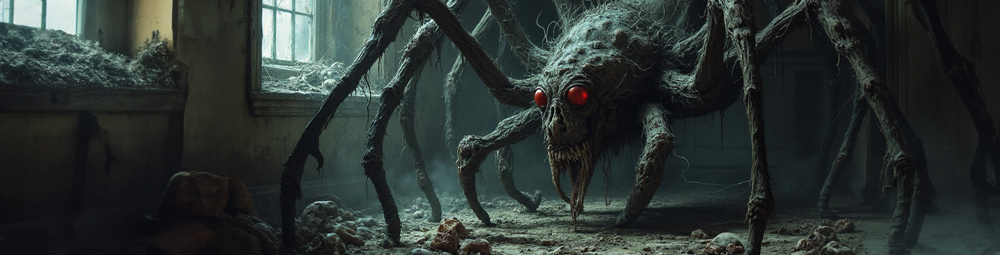

# 🎨 Anashel's LoRA Merging Utility

This tool allows you to merge two LoRA models using adaptive merging strategies. You can choose between a single weighted merge or a mix of three different weight ratios. This utility will guide you step-by-step through the process of selecting and merging your LoRA models.


YouTube on My Merged LoRAs: https://www.youtube.com/watch?v=VUV6bzml2SU

## ✨ Features

- **Adaptive Merging**: Merge two LoRA models with adaptive merge strategies.
- **Manual Weight Merging**: Support for traditional weighted merging, allowing users to force specific weights.
- **Mix or Weighted Options**: Choose from single weighted, or create mixed versions for 25%, 50%, and 75% weights automatically.
- **User-Friendly Guidance**: Easy-to-follow prompts guide you through the setup.

## 📋 What is Adaptive Merging

Adaptive merging is a unique approach that adjusts the contribution of each LoRA model dynamically based on their characteristics rather than using fixed or arbitrary weights. This is particularly useful when combining models that have different focuses, such as content and style. If you're interested in the implementation, you can look at the `adaptive_merge()` function in `merge_lora.py`.

### Why I Use Adaptive Merging

I currently have over 20 concepts for RPGv6 and need to add around 50 more. I aim to avoid training individual LoRA files for each RPG class and race. During training, I noticed I was losing some ability to render my concepts in different styles (pencil, sketch, real life, concept art) because the initial art style used for training concepts tends to dominate. Adding more diverse images to the dataset didn't fully resolve this.

So, I trained a second LoRA focused on rendering styles of the same classes with specific emphasis on keywords. Instead of merging all of this in a single training session, I use adaptive merging to enhance the power of the style LoRA while balancing my concept LoRA. The improvements were significant enough to make this utility publicly available, hoping it might help others facing similar challenges.

In the future, I might need to train an entire checkpoint, but for now, adaptive merging pushes the limits of my RPG v6 LoRA effectively.

### Manual Weight Merging Also Available
In adaptive merge, the weight value is used when adaptive merging identifies conflicting layers or important overlaps that need prioritization. Sometimes, you may want to force a weight and ignore adaptive merge recommendations. LoRA will behave differently, so having the traditional weight merge approach is valuable for experimentation.

## 📋 Prerequisites

- **Python 3.6 or higher** installed on your system.
- **Git** installed on your system.
- **Basic understanding of using command line** or terminal.

## 🛠️ Setup Instructions

### Step 1: Clone the Repository

1. Click on the **Code** button at the top right of this page.
2. Copy the URL and open your terminal (Command Prompt on Windows, Terminal on macOS/Linux).
3. Clone the repository with the following commands:

   ```bash
   git clone https://github.com/Anashel-RPG/anashel-utils.git
   cd anashel-utils
   ```

### Step 2: Make the Start Script Executable (macOS/Linux Only)

For macOS/Linux users, you need to make the `start_mac-linux.sh` script executable:

```bash
chmod +x start_mac-linux.sh
```

### Step 3: Run the Utility

**For macOS/Linux Users:**

Run the following command to start the utility:

```bash
./start_mac-linux.sh
```

**For Windows Users:**

Click on `start_windows.bat` in the project folder, or run the following command in Command Prompt:

```cmd
start_windows.bat
```

## 📖 How to Use the LoRA Merging Utility

Once the utility is running, it will guide you through each step. Below is a sample console output to give you an idea of what to expect:

```
Boot routine initiated...
┌──────────────────────────────── LoRA Merger ────────────────────────────────┐
│ Welcome to the Anashel's LoRA Merging Utility!                              │
│                                                                             │
│ This tool allows you to merge two LoRA models using adaptive merging        │
│ strategies. You can choose between a single weighted merge or a mix of      │
│ three different weight ratios. The process will guide you through selecting │
│ your LoRA models and merge settings.                                        │
└─────────────────────────────────────────────────────────────────────────────┘

Press Enter to continue...

This utility allows you to set up a merge of LoRA models by selecting two 
models and adjusting the merge weight percentage.

Loading LoRA models: 100%|██████████| 2/2 [00:00<00:00, 12.67file/s]

+-------+------------+------------------+-----------+
| Index | LoRA Model | Number of Layers | File Size |
+-------+------------+------------------+-----------+
|   1   | 067-15000  |       380        | 142.55 MB |
|   2   | 071-12000  |       380        | 142.55 MB |
+-------+------------+------------------+-----------+

Select the main LoRA source (1-2): 1
Select the LoRA to merge with (1-2): 2

Enter the percentage to keep from the main model (0-100)
You can also type 'mix' for 25%, 50%, 75% versions: 30

You have chosen to merge:
Main LoRA: 067-15000
Merge LoRA: 071-12000
Merge Strategy: Weighted
Weight Percentage: 30.0%
Is this satisfactory? (no to adjust, yes to continue): yes

Merging completed! ✅
```

## 📖 Naming Convention

Your new LoRA will start with `mrg_` to identify this was the result of a merge, then you will have the first and second LoRA names with a 3-letter tag in the middle. `A` stands for Adaptive, `M` stands for Manual, followed by the weight percentage. For example, `A25` means that this merge is the result of an Adaptive approach with a 25% weight, while `M75` is a manual imposed 75% merge for all layers in the LoRA.

## ⚠️ Troubleshooting

### Common Issues

- **Python Not Installed**: Ensure Python 3.6 or higher is installed on your system. You can download it from [python.org](https://www.python.org/downloads/).
- **Permission Denied (macOS/Linux)**: Make sure to run `chmod +x start_mac-linux.sh` to make the script executable.
- **Dependencies Not Installed**: The script will automatically install dependencies listed in `requirements.txt`. Ensure you have an active internet connection when running the script.

## 🚀 Future Updates

I plan to upload all the utilities I've coded to assist in my training of RPG v6, including image auto-captioning and style transfer to diversify and enrich datasets. In the meantime, feel free to join my Discord community for updates and discussions: [Join my Discord](https://discord.gg/byecho).

You can also download my LoRA: [RPG v6 for Flux1 on CivitAI](https://civitai.com/models/647159/rpg-v6-flux-1).

#### - 33 -  ####